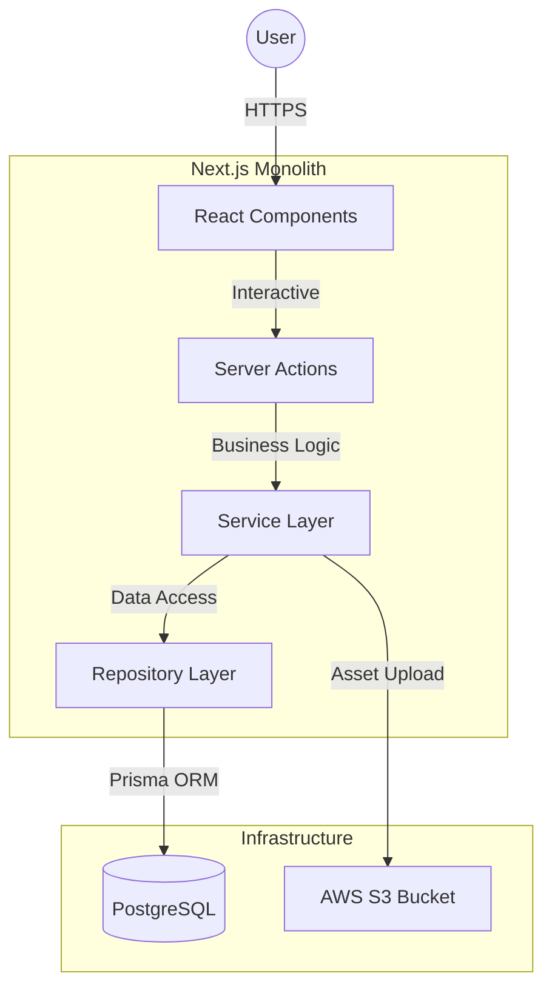

# 📍 Kia Nha Trang – Management System

[](https://github.com/kasperdinh/oto-kia-nha-trang) [](https://www.typescriptlang.org) [](https://nextjs.org) [](https://tailwindcss.com) [](https://www.postgresql.org) [](LICENSE)


> **A comprehensive digital solution for automotive dealership management.**
>
> _Handling inventory, lead tracking, and rich content management for Kia Nha Trang / Khanh Hoa._

[View Demo](https://kiakhanhhoa.vn) • [Report Bug](mailto:dinhnhatbao.work@gmail.com) • [Request Feature](mailto:dinhnhatbao.work@gmail.com)

---

## 📖 Table of Contents

- [📍 Project Overview](#-project-overview)
- [🛠 Tech Stack & Architecture](#-tech-stack--architecture)
- [📂 Project Structure](#-project-structure)
- [🚀 Getting Started](#-getting-started)
- [⚙️ Configuration](#️-configuration)
- [🌱 Roadmap](#-roadmap)
- [🤝 Contributing](#-contributing)
- [📄 License](#-license)

---

## 📍 Project Overview

The **Kia Nha Trang Management System** is designed to streamline operations for the dealership. It moves beyond simple spreadsheets to a robust, integrated platform that connects inventory management with customer lead storage.

### 🎯 Key Goals

- **Centralized Inventory:** Single source of truth for car models, variants, and pricing.
- **Lead Optimization:** Capture and track customer interest from initial contact to test drive.
- **Content Richness:** Deliver high-quality marketing assets (images, brochures) via an integrated CMS.

### ✨ Key Features

#### 🚗 **Inventory Management**

- **Model Hierarchy:** Manage Cars (e.g., Seltos) -> Variants (e.g., 1.4 Turbo) -> Colors.
- **Rich Media:** Integration with **AWS S3** for hosting high-res gallery images and spec sheets.
- **SEO Metadata:** Automatic generation of SEO tags for public-facing model pages.

#### 👥 **Lead Tracking**

- **Workflow Automation:** Track leads through status changes (Pending -> Processed -> Archived).
- **Source Attribution:** Identify if leads came from quotes, test drives, or general inquiries.

#### ⚙️ **System Administration**

- **RBAC:** Secure Admin and User roles via **NextAuth.js v5**.
- **Master Data:** Centralized control over shared resources like color palettes and document types.

---

## 🛠 Tech Stack & Architecture

This project is built as a **Monolithic Next.js Application**, leveraging Server Actions for backend logic and React Server Components for performance.



### 🏗 Application Layer

| Component     | Technology                  | Description                                           |
| :------------ | :-------------------------- | :---------------------------------------------------- |
| **Framework** | **Next.js 15 (App Router)** | Full-stack framework with React Server Components.    |
| **Styling**   | **Tailwind CSS 4**          | Utility-first CSS framework for rapid UI development. |
| **Auth**      | **NextAuth.js v5**          | Secure authentication and session management.         |
| **Editor**    | **Tiptap**                  | Headless rich text editor for content management.     |

### 🗄 Infrastructure & Data

| Component    | Technology     | Description                                      |
| :----------- | :------------- | :----------------------------------------------- |
| **Database** | **PostgreSQL** | Primary relational database for structured data. |
| **ORM**      | **Prisma**     | Type-safe database client and schema management. |
| **Storage**  | **AWS S3**     | Object storage for vehicle images and documents. |
| **Testing**  | **Playwright** | End-to-end testing framework.                    |

---

## 📂 Project Structure

```bash
├── app/                  # Next.js App Router pages & API routes
├── components/           # Reusable UI components
├── constants/            # Shared static constants
├── dtos/                 # Data Transfer Objects
├── lib/                  # Utility functions & external client configuration
├── prisma/               # Database schema & migrations
├── public/               # Static assets
├── repositories/         # Data access layer (Prisma abstraction)
├── services/             # Business logic layer
├── types/                # TypeScript type definitions
├── validators/           # Zod schemas for input validation
└── tests/                # Playwright E2E tests
```

---

## 🚀 Getting Started

### Prerequisites

- **Node.js 20+**
- **PostgreSQL** (Local or Remote)
- **AWS Account** (S3 Bucket & Credentials)

### Installation

1.  **Clone the repository**

    ```bash
    git clone https://github.com/kasperdinh/oto-kia-nha-trang.git
    cd oto-kia-nha-trang
    ```

2.  **Install dependencies**

    ```bash
    npm install
    ```

3.  **Environment Setup**

    ```bash
    cp .env.example .env
    ```

4.  **Database Setup**

    ```bash
    # Generate Prisma Client
    npx prisma generate

    # Push schema to DB
    npx prisma db push

    # Seed initial data
    npm run prisma:seed
    ```

5.  **Run Development Server**
    ```bash
    npm run dev
    ```

---

## ⚙️ Configuration

Configure these variables in your `.env` file.

| Variable                | Description                         |
| :---------------------- | :---------------------------------- |
| `DATABASE_URL`          | Connection string for PostgreSQL.   |
| `NEXT_PUBLIC_BASE_URL`  | Base URL of the application.        |
| `AUTH_SECRET`           | Secret key for NextAuth encryption. |
| `AWS_ACCESS_KEY_ID`     | AWS IAM Access Key.                 |
| `AWS_SECRET_ACCESS_KEY` | AWS IAM Secret Key.                 |
| `AWS_REGION`            | AWS Region (e.g., ap-southeast-1).  |
| `AWS_BUCKET_NAME`       | Name of the S3 bucket for storage.  |

---

## 🌱 Roadmap

> ✅ **Current Status:** Completed

- [x] **Project Setup**
  - [x] Next.js App Router initialization
  - [x] Database Schema Design (Prisma)
  - [x] Authentication Setup (Login/Logout)

- [x] **Core Features**
  - [x] **Car Management:** CRUD for Models & Variants
  - [x] **Gallery System:** Drag & drop upload to S3
  - [x] **Lead Dashboard:** Kanji-board style lead tracking
  - [x] **Admin Panel:** User management & Role assignment

- [x] **Optimization**
  - [x] Image Optimization (Next/Image)
  - [x] Caching Strategies (unstable_cache)
  - [x] Comprehensive E2E Tests

---

## 🤝 Contributing

1.  Fork the project.
2.  Create your feature branch (`git checkout -b feature/NewFeature`).
3.  Commit your changes (`git commit -m 'Add NewFeature'`).
4.  Push to the branch (`git push origin feature/NewFeature`).
5.  Open a Pull Request.

---

## 📄 License

Distributed under the **MIT License**. See [LICENSE](LICENSE) for more information.
